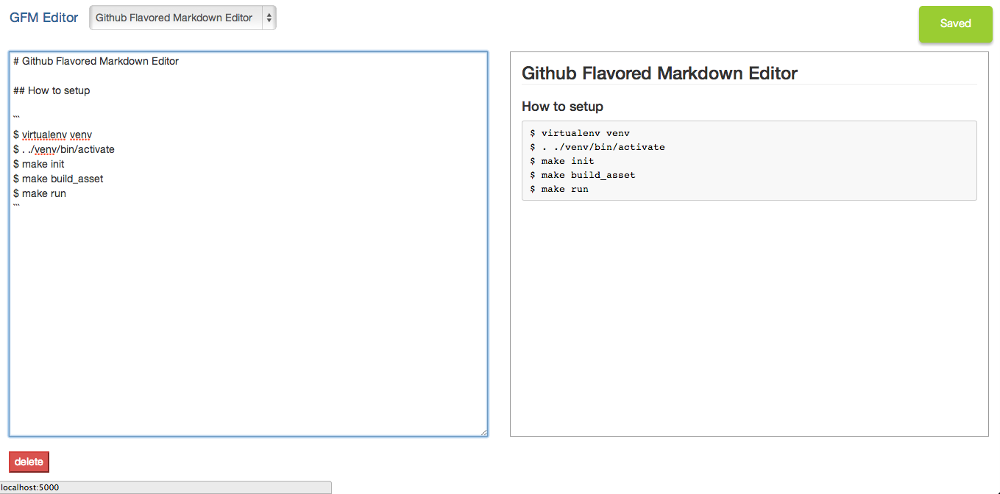

# Github Flavored Markdown Editor



## How to setup

```sql
$ createdb gfmeditor
$ psql -d gfmeditor -c 'CREATE TABLE note (id serial primary key, title text not null, raw text not null);'
```

```
$ virtualenv venv
$ . ./venv/bin/activate
$ make init
$ make build_asset
$ make run
```
